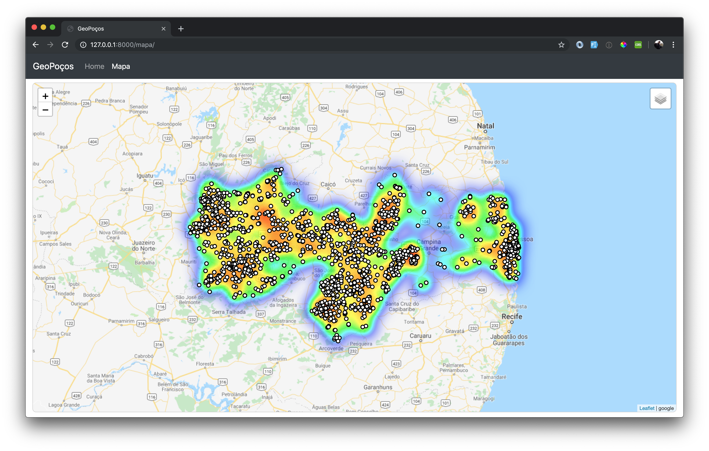

# GEOPOÇOS - 🌵 GeoDjango Unchained 🌵

Projeto apresentado na Live de Python do Canal **Geocast Brasil**  


A live foi apresentada em duas sessões:  
### Live 1:  
Apresentada no dia 10/10/2019 e abordou parcialmente o conteúdo (até o ponto 6), está disponível em:  
 [](https://www.youtube.com/watch?v=ofTUgfZbEkU)  

### ÍNDICE DA APRESENTAÇÃO:

1. [APRESENTAÇÃO](docs/01-apresentacao.md) [Live 1: 7:00](https://youtu.be/ofTUgfZbEkU?t=420)  
2. [INSTALAÇÃO](docs/02-instalacao.md) [Live 1: 9:44](https://youtu.be/ofTUgfZbEkU?t=583)  
3. [HELLO WORLD](docs/03-hello_world.md) [Live 1: 45:57](https://youtu.be/ofTUgfZbEkU?t=2757)  
4. [USANDO O BOOTSTRAP COM HERANÇA DE TEMPLATES](docs/04-heranca-de-templates.md) [Live 1: 1:04:14](https://youtu.be/ofTUgfZbEkU?t=3840)  
5. [NOSSO PRIMEIRO MAPA](docs/05-nosso-primeiro-mapa.md)
6. [MODELS](docs/06-models.md) [Live 1: 1:18:47](https://youtu.be/ofTUgfZbEkU?t=4727)  
7. [ADICIONANDO OS POÇOS NO MAPA](docs/07-adicionando-pocos-mapa.md) [Live 1: 1:38:07](https://youtu.be/ofTUgfZbEkU?t=5885) 

### Live 2:
Apresentada no dia 24/10/2019, está disponível em:  
[](https://www.youtube.com/watch?v=04O45CQ9gcc)  
:warning: Nessa ultima *live* tivemos alguns problemas computacionais, o gerou atraso na apresentação dos conteúdos propostos. A partir do minúto 30:00 começamos, enfim, a trabalhar com o que havíamos proposto :);    

### ÍNDICE DA APRESENTAÇÃO:

1. **REVISÃO LIVE ANTERIOR** [Live 2: 30:00](https://youtu.be/04O45CQ9gcc?t=1801)  
2. [MODELS - ogrinspect](docs/06-models.md) [Live 2: 37:08](https://youtu.be/04O45CQ9gcc?t=2220)  
3. CARREGANDO OS DADOS À BASE DE DADOS [Live 2: 43:00](https://youtu.be/04O45CQ9gcc?t=2580)  
4. ADMIN [Live 2: 50:27](https://youtu.be/04O45CQ9gcc?t=3444)  
5. ADJANGO-LEAFLET [Live 2: 1:00:38](https://youtu.be/04O45CQ9gcc?t=3630)  
6. VIEW [Live 2: 1:12:00](https://youtu.be/04O45CQ9gcc?t=4322)  
7. TEMPLATE [Live 2: 1:39:00](https://youtu.be/04O45CQ9gcc?t=5940)  
8. MAPA [Live 2: 1:42:00](https://youtu.be/04O45CQ9gcc?t=6121)  
9. [CRIANDO O MAPA DE INTENSIDADE DE PONTOS (HEATMAP)](docs/08-adicionado-heatmap.md)  [Live 2: 1:56:00](https://youtu.be/04O45CQ9gcc?t=6953)  
10. DUVIDAS E COMENTÁRIOS [Live 2 2:30:00 ](https://youtu.be/04O45CQ9gcc?t=9000)  


## REQUISITOS
* Python 3+ (de preferência o Python 3.7.4)
* PostgreSQL >= 10
* PostGIS >= 2.5.0
* GDAL, no linux instale com: `apt-get install python-gdal`. Se for mac um `brew install gdal` é suficiente.

## CONFIGURAÇÕES DO BANCO DE DADOS ESPACIAIS

É necessário criar um banco **PostgreSQL** e habilitar a extensão espacial **PostGIS**, no terminal, faça:

```
createdb geopocos
psql geopocos
CREATE EXTENSION postgis;
\d
```

## COMO DESENVOLVER?

* Clone o repositório;
* Crie um virtualenv com Python 3.7.4;
* Ative o virtualenv;
* Instale as dependências do ambiente de desenvolvimento;
* Crie o banco de dados espacial como foi descrito acima.


```
git clone https://github.com/marcellobenigno/geopocos.git
cd geopocos
python -m venv .venv
source .venv/bin/activate
pip install -r requirements-dev.txt
```

* Renomeie o arquivo `env-sample` para `.env`:

```
mv env-sample .env
```

* Preencha as informações do `.env` e rode os seguintes comandos:

```
python manage.py makemigrations
python manage.py migrate
```

* Adicione os registros nas duas tabelas:

```
python manage.py loaddata poco
python manage.py loaddata municipio
```


* Rode o `runserver`...

```
python manage.py runserver
```

...e verifique se o mapa abaixo é exibido no link **mapa**:

