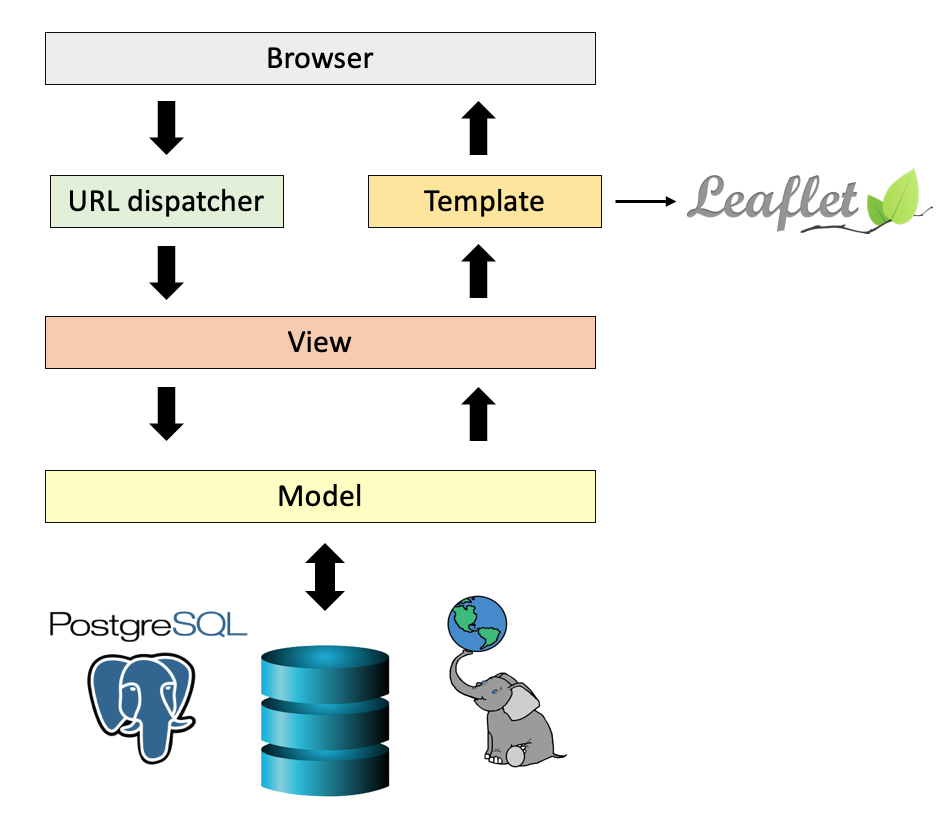

# 🌵 GEODJANGO UNCHAINED 🌵

## SOBRE O INSTRUTOR 🤓 :

**Marcello Benigno Borges de Barros Filho**

- Engenheiro Civil formado (UFCG)
- Especialista em Desenvolvimento Web (Unibratec)
- Mestre em Ciências Geodésicas e Tecnologias da Geoinformação (UFPE)
- Professor do Curso Superior de  Tecnologia em Geoprocessamento do IFPB desde 2006

Onde me encontrar:

- benigno.marcello@gmail.com e-mail ✉️  
- [@marcellobenigno](https://twitter.com/marcellobenigno) twitter 🐦 
- [@mbfilho](https://t.me/mbfilho)  telegram 💬 

## TECNOLOGIAS UTILIZADAS NESTE PROJETO:

### Django:

 - **Django** é um framework para desenvolvimento rápido para web, escrito em **Python**, que utiliza o padrão Model-View-Template (MVT)
 - **GeoDjango** é o módulo nativo do Django para criar aplicações geográficas

### PostGIS:

- É  uma **extensão** espacial do sistema de banco de dados objeto-relacional PostgreSQL
- Permite o armazenamento e manipulação de dados espaciais em um banco de dados objeto relacional

### Leaflet:

- É uma biblioteca JavaScript Open Source  para criação de Web mapas interativos.
- Possui uma série de plugins
- Extremamente leve
- Possui uma boa documentação