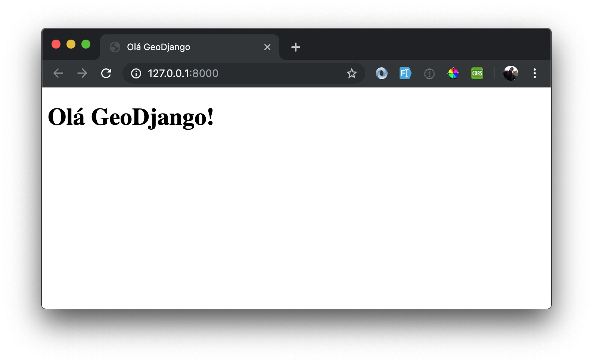

# 2. HELLO WORLD

Vamos criar a página inicial do nosso projeto, para isso iremos trabalhar na  app `core`

``` bash
# na pasta geopocos/geopocos, digite:
python ../manage.py startapp core
```
Se você tiver criado o alias, no bashrc, lembre-se de fazer apenas:

```bash
m startapp core
```
### Registrando a app `core`no arquivo `settings.py`:

```python
INSTALLED_APPS = [
    'django.contrib.admin',
    'django.contrib.auth',
    'django.contrib.contenttypes',
    'django.contrib.sessions',
    'django.contrib.messages',
    'django.contrib.staticfiles',
    # GeoDjango
    'django.contrib.gis',
    # My apps
    'geopocos.core',
]
```

### 2.1 Criando a view `index`

Edite o arquivo `geopocos/geopocos/core/view.py`, adicionando o seguinte conteúdo:

```python
from django.shortcuts import render

from geopocos.poco.models import Poco


def index(request):
    return render(request, 'core/index.html') 
```

Crie o arquivo `index.html` dentro de `geopocos/geopocos/core/templates/core/`, com o seguinte conteúdo:

```html
<!DOCTYPE html>
<html lang="pt-br">
<head>
    <meta charset="UTF-8">
    <title>Olá GeoDjango</title>
</head>
<body>
    <h1>Olá GeoDjango!</h1>
</body>
</html>
```

### 2.2 Criando a URL da nossa página inicial:

Edite o arquivo `geopocos/geopocos/urls.py`

```python
from django.contrib import admin
from django.urls import path

from .core import views

urlpatterns = [
    path('', views.index),
    path('admin/', admin.site.urls),
]
```

Rode o `runserver` no terminal, para ver o *Olá GeoDjango* 😄



### 2.3 Refatorando o arquivo de urls:

Crie na pasta `geopocos/geopocos/core/` um arquivo com o nome `urls.py`, e dentro dele, coloque o seguinte conteúdo:

```python
from django.urls import path

from . import views as v

app_name = 'core'

urlpatterns = [
    path('', v.index, name='index'),
]
```

e altere o arquivo `geopocos/geopocos/urls.py`:

```python
from django.contrib import admin
from django.urls import path, include

urlpatterns = [
    path('', include('geopocos.core.urls')),
    path('admin/', admin.site.urls),
]
```

Desta forma, cada app terá o seu arquivo de urls, facilitando a manuteção das urls e a organização do seu código.