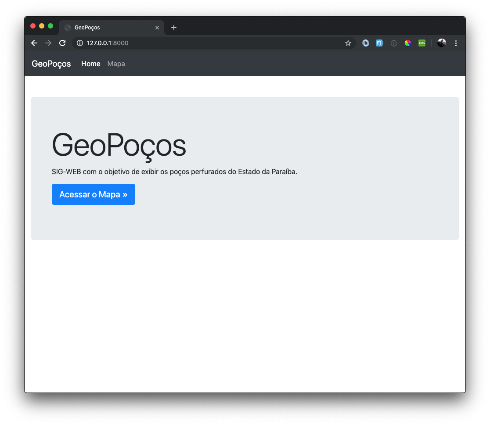

# 4. USANDO O BOOTSTRAP COM HERANÇA DE TEMPLATES

Vamos melhorar a nossa página inicial adicionando o [Bootstrap](https://getbootstrap.com.br/). Para isto, crie dentro da pasta `geopocos/geopocos/core` a pasta `static`, crie a seguinte estrutura dentro dela:

```
.
├── css
│   └── main.css
├── js
│   └── jquery-3.3.1.min.js
└── libs
    ├── bootstrap-4.1.3
```

Agora, crie o arquivo `base.html`, na pasta `geopocos/geopocos/core/templates`, com o seguinte conteúdo:

```html


<!doctype html>
<html lang="pt-br">
<head>
    <meta charset="utf-8">
    <meta name="viewport" content="width=device-width, initial-scale=1, shrink-to-fit=no">
    <meta name="description" content="">
    <title>GeoPoços</title>
    <link href="" rel="stylesheet">
    <link href="" rel="stylesheet">
</head>

<body>



<div class="container-fluid">
    
    
</div>

<script src=""></script>
<script src=""></script>
<script src=""></script>


</body>
</html>
```
💡 A template tag **static** serve para construir o caminho relativo até os arquivos estáticos do seu projeto, mais detalhes, na 📚 [documentação oficial](https://docs.djangoproject.com/pt-br/2.2/howto/static-files/).

💡 O **include** adiciona um trecho de código HTML a nossa página que servirá de **base** para as outras páginas dos templates do nosso projeto. Vamos então criar este arquivo (`navbar.html`) no diretório `geopocos/geopocos/core/templates/includes`:

```html
<header>
    <nav class="navbar navbar-expand-md navbar-dark fixed-top bg-dark">
        <a class="navbar-brand" href="">GeoPoços</a>
        <button class="navbar-toggler" type="button" data-toggle="collapse" data-target="#navbarCollapse"
                aria-controls="navbarCollapse" aria-expanded="false" aria-label="Toggle navigation">
            <span class="navbar-toggler-icon"></span>
        </button>
        <div class="collapse navbar-collapse" id="navbarCollapse">
            <ul class="navbar-nav mr-auto">
                <li class="nav-item">
                    <a class="nav-link" href="">Home</a>
                </li>
                <li class="nav-item">
                    <a class="nav-link" href="#">Mapa</a>
                </li>
            </ul>
        </div>
    </nav>
</header>
```

Edite o arquivo index.html, alterando o seu conteúdo para:

```html




    <div class="jumbotron mt-lg-5">
        <div class="container">
            <h1 class="display-3">GeoPoços</h1>
            <p>SIG-WEB com o objetivo de exibir os poços perfurados do Estado da Paraíba.</p>
            <p>
              <a class="btn btn-primary btn-lg" href="#" role="button">
                Acessar o Mapa »
              </a>
            </p>
        </div> <!-- container -->
    </div> <!-- jumbotron mt-lg-5 -->


```

Por último, adicione no arquivo `main.css`:

```css
body {
    padding-top: 3.5rem;
}
```

Reinicie o `runserver` e veja como ficou 😍 :

