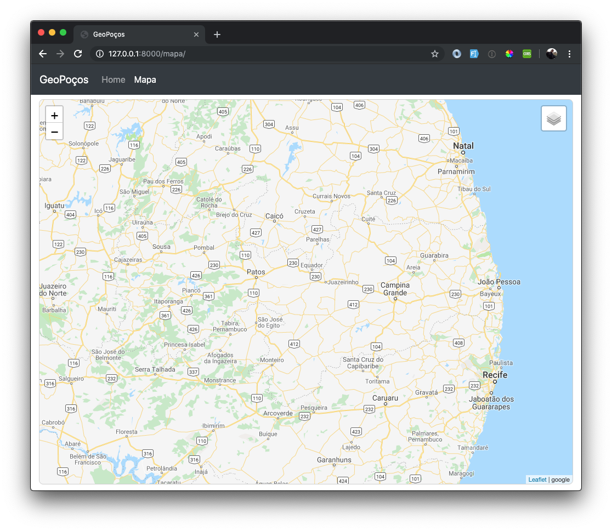

# 5. NOSSO PRIMEIRO MAPA 🌎

Vamos adicionar a biblioteca [Leaflet](https://leafletjs.com/) no pasta libs, dos nossos arquivos estáticos, em `geopocos/geopocos/core/static`: 
```
.
├── css
│   └── main.css
├── js
│   └── jquery-3.3.1.min.js
└── libs
    ├── bootstrap-4.1.3
    ├── leaflet
```

Em seguida, altere o arquivo `base.html`:

```html


<!doctype html>
<html lang="pt-br">
<head>
    <meta charset="utf-8">
    <meta name="viewport" content="width=device-width, initial-scale=1, shrink-to-fit=no">
    <meta name="description" content="">
    <title>GeoPoços</title>
    <link href="" rel="stylesheet">
    <link href="" rel="stylesheet">
    
    
</head>
<body>


<div class="container-fluid">
    
    
</div>
<script src=""></script>
<script src=""></script>


</body>
</html>
```

Agora poderemos criar uma nova **view** que será responsável por renderizar um **template** com o nosso mapa, para isso, altere o arquivo `geopocos/geopocos/core/views/py`:

```python
from django.shortcuts import render


def index(request):
    return render(request, 'core/index.html')


def mapa(request):
    return render(request, 'core/mapa.html', context)
```

e o conteúdo do arquivo `geopocos/geopocos/core/mapa.html` será esse:

```html




    <link href="" rel="stylesheet">



    <div id="map"></div>



    <script src=""></script>
    <script src=""></script>

```

Devemos então criar o arquivo `geopocos/geopocos/core/static/js/map.js`:

```javascript
var gstreets = L.tileLayer('http://www.google.cn/maps/vt?lyrs=m@189&gl=cn&x={x}&y={y}&z={z}', {
    maxZoom: 20,
    attribution: 'google'
});

var satellite = L.tileLayer('http://www.google.cn/maps/vt?lyrs=s@189&gl=cn&x={x}&y={y}&z={z}', {
    maxZoom: 20,
    attribution: 'google'
});

var map = L.map('map', {
    center: [-7.166300, -36.77673],
    zoom: 8,
    maxZoom: 20,
    layers: [gstreets],
});

var baseLayers = {
    "Google Streets": gstreets,
    "Google Satélite": satellite,
};

var overlays = {
};

var control = L.control.layers(baseLayers, overlays).addTo(map); 
```

O Leaflet precisa que a **div** `map` tenha sua altura e largura definida para poder exibir o mapa, então vamos alterar o nosso arquivo `main.css` adicionando:

```css
body {
    padding-top: 3.5rem;
}

#map {
    margin-top: 0.5rem;
    padding: 0;
    width: 100%;
    min-height: calc(100vh - 75px);
    border: 1px solid #cfcfcf;
    border-radius: 8px;
}
```

Agora, iremos criar a nossa rota no arquivo `core/urls.py`:

```python
from django.urls import path

from . import views as v

app_name = 'core'

urlpatterns = [
    path('', v.index, name='index'),
    path('mapa/', v.mapa, name='mapa'),
]
```

**Pronto!** Reinicie o `runserver`e veja como ficou: 

```bash
m runserver
```



**OBS:** Não se esqueça de criar os links para o mapa na **navbar** e na **página inicial**. 