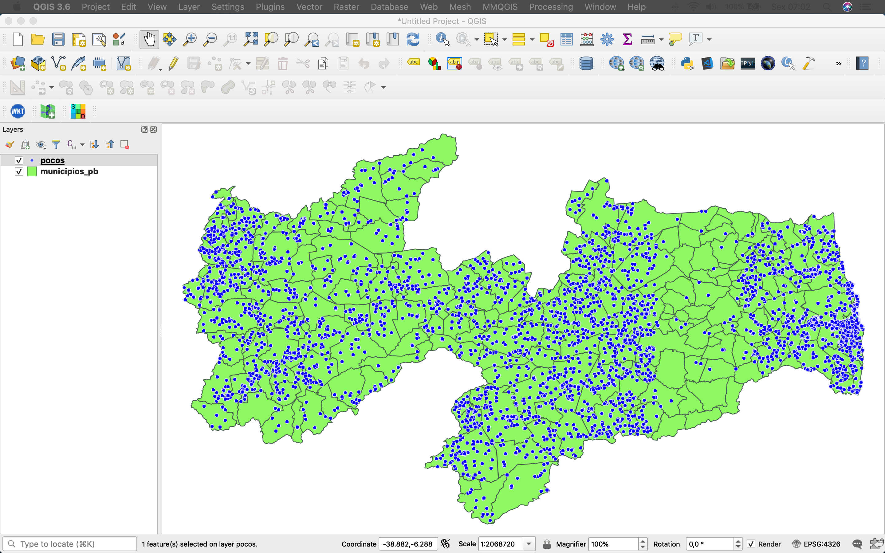
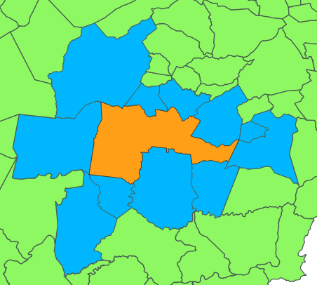

# 6. MODELS

Vamos criar dois modelos, que representarão duas tabelas no nosso banco de dados, são elas: `Poco` e `Municipio`. Para isso, utilizaremos como base dois arquivos no formato Shapefile que estão na pasta **data**. A figura abaixo mostra os dois Shapefiles no Software QGIS.



### 5. 1 Criando as apps `municipio` e `poco`:

No terminal, dentro da pasta `geopocos/geocopos`, digite:
```bash
m startapp municipio
m startapp poco
```

Não esqueça de registrar as duas apps em `settings.py`:

```python
INSTALLED_APPS = [
    'django.contrib.admin',
    'django.contrib.auth',
    'django.contrib.contenttypes',
    'django.contrib.sessions',
    'django.contrib.messages',
    'django.contrib.staticfiles',
    # GeoDjango
    'django.contrib.gis',
    # My apps
    'geopocos.core',
    'geopocos.municipio',
    'geopocos.poco',
]
```

### 6.2 Gerando os modelos a partir dos shapefiles:

O comando `ogrinspect` é utilizado para inspecionar um arquivo shapefile e tem como saída um modelo, no qual o seu nome deve ser fornecido pelo usuário, e os campos, definidos de acordo com os atributos do arquivo lido.

```bash
m ogrinspect data/municipios_pb.shp Municipio --srid 4326 --mapping > geopocos/municipio/models.py
```
Resultado:

```python
from django.contrib.gis.db import models


class Municipio(models.Model):
    nome = models.CharField('nome', max_length=40)
    cod_ibge_m = models.CharField('código IBGE', max_length=20)
    geom = models.MultiPolygonField('geom', srid=4326)

    def __str__(self):
        return self.nome
```

Com o `LayerMapping` é possível criar o arquivo `load.py`:

```python
import os

from django.contrib.gis.utils import LayerMapping

from .models import Municipio

# Auto-generated `LayerMapping` dictionary for Municipio model
municipio_mapping = {
    'nome': 'nome',
    'cod_ibge_m': 'cod_ibge_m',
    'geom': 'MULTIPOLYGON',
}

municipio_shp = os.path.abspath(os.path.join('data', 'municipios_pb.shp'))

def run_municipios(verbose=True):
    lm = LayerMapping(Municipio, municipio_shp, municipio_mapping)
    lm.save(strict=True, verbose=verbose)
```

Gerando o modelo `Poco`:

```bash
m ogrinspect data/pocos.shp Poco --srid 4326 --mapping > geopocos/poco/models.py
```

```python
from django.contrib.gis.db import models


class Poco(models.Model):
    proprietario = models.CharField('proprietário', max_length=255, null=True, blank=True)
    orgao = models.CharField('órgão responsável', max_length=255, null=True, blank=True)
    data_perfuracao = models.DateField('data de perfuração', null=True, blank=True)
    profundidade = models.FloatField('profundidade (m)', null=True, blank=True)
    q_m3h = models.FloatField('vazão m3/h', null=True, blank=True)
    equipamento = models.CharField('equipamento', max_length=255, null=True, blank=True)
    geom = models.PointField('geom', srid=4326)

    def __str__(self):
        return self.proprietario
```
Mapeamento (arquivo `load.py`) :

```python
import os
from django.contrib.gis.utils import LayerMapping

from .models import Poco

poco_mapping = {
    'proprietario': 'proprietar',
    'orgao': 'orgao',
    'data_perfuracao': 'data_perfur',
    'profundidade': 'profundida',
    'q_m3h': 'q_m3h',
    'equipamento': 'equipament',
    'geom': 'POINT',
}

poco_shp = os.path.abspath(os.path.join('data', 'pocos.shp'))

def run_pocos(verbose=True):
    lm = LayerMapping(Poco, poco_shp, poco_mapping)
    lm.save(strict=True, verbose=verbose)
```

### 6.3 Carga de dados:

```bash
from geopocos.poco.load import run_pocos

run_pocos()
```

```bash
from geopocos.municipio.load import run as run_municipios

run_municipios()
```

### 6.4 ORM

Com o ORM do Django você define a modelagem de dados através de classes em Python. desta forma, é possível criar tabelas no banco de dados e manipulá-las sem necessidade de utilizar SQL.

Exemplos:

```python
# Retorne todos os poços
Poco.objects.all()

# obtendo um determinado poço através de sua chave primária:
Poco.objects.get(id=1)

# Poços que que pertencem à prefeituras
Poco.objects.filter(proprietario__icontains='prefeitura')

# Poços com vazão entre 20 e 100 m3/h:
Poco.objects.filter(q_m3h__range=[20,100])

# Poços perfurados antes do dia 01/01/1990, ordenados pela data de perfuração de forma decrescente:
import datetime as dt
data_lim = dt.date(1990, 1, 1)
Poco.objects.filter(data_perfuracao__lt=data_lim).order_by('-data_perfuracao')

# Poços instalados pelos órgãos: CAGEPA OU DNOCS:
from django.db.models import Q
Poco.objects.filter(Q(orgao='DNOCS') | Q(orgao='CAGEPA'))

# Obtendo a maior vazão:
from django.db.models import Max
Poco.objects.aggregate(Max('q_m3h'))
```

###  5.5 Consultas Topológicas

```python
# Poços que estão no município de Patos:
municipio = Municipio.objects.get(nome='Patos')
Poco.objects.filter(geom__within=municipio.geom)

# Quantos poços não estão no município de Santa Rita?
m1 = Municipio.objects.get(nome='Santa Rita')
Poco.objects.filter(geom__disjoint=m1.geom).count()

# Municípios vizinhos de Campina Grande:
cg = Municipio.objects.get(nome='Campina Grande')
Municipio.objects.filter(geom__touches=cg.geom)
```

