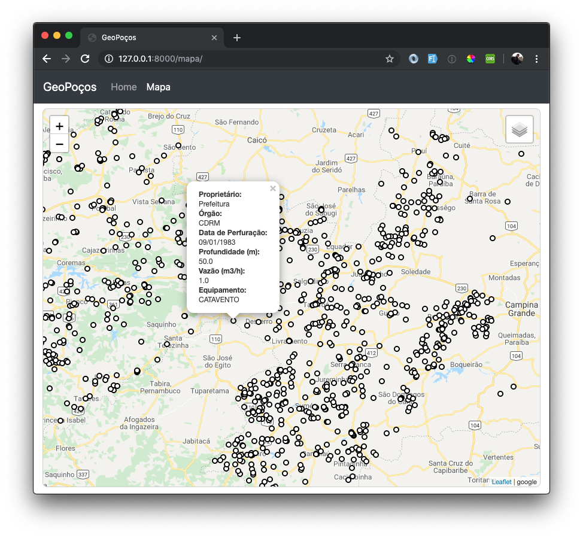

# 6. ADICIONANDO OS POÇOS NO MAPA

Vamos instalar dois pacotes:

```bash
pip install django-geojson django-leaflet
```

E colocá-las no nosso `settings.py`:

```python
INSTALLED_APPS = [
    'django.contrib.admin',
    'django.contrib.auth',
    'django.contrib.contenttypes',
    'django.contrib.sessions',
    'django.contrib.messages',
    'django.contrib.staticfiles',
    # GeoDjango
    'django.contrib.gis',
    # Other apps
    'leaflet',
    'djgeojson',
    # My apps
    'geopocos.core',
    'geopocos.municipio',
    'geopocos.poco',
]
```

Criaremos uma `@property` no nosso modelo, para exbir os dados em uma janela popup:

```python
from django.contrib.gis.db import models
from django.template.defaultfilters import date


class Poco(models.Model):
    proprietario = models.CharField('proprietário', max_length=255, null=True, blank=True)
    orgao = models.CharField('órgão responsável', max_length=255, null=True, blank=True)
    data_perfuracao = models.DateField('data de perfuração', null=True, blank=True)
    profundidade = models.FloatField('profundidade (m)', null=True, blank=True)
    q_m3h = models.FloatField('vazão m3/h', null=True, blank=True)
    equipamento = models.CharField('equipamento', max_length=255, null=True, blank=True)
    geom = models.PointField('geom', srid=4326)

    def __str__(self):
        return self.proprietario

    @property
    def popup_content(self):
        popup = "<span>Proprietário: </span>{}".format(
            self.proprietario)
        popup += "<span>Órgão: </span>{}".format(
            self.orgao)
        popup += "<span>Data de Perfuração: </span>{}".format(
            date(self.data_perfuracao, "d/m/Y"))
        popup += "<span>Profundidade (m): </span>{}".format(
            self.profundidade)
        popup += "<span>Vazão (m3/h): </span>{}".format(
            self.q_m3h)
        popup += "<span>Equipamento: </span>{}".format(
            self.equipamento)
        return popup
```


Em seguida, já podemos criar nossa `view` em `geopocos/geopocos/poco/views.py`:

```python
from django.shortcuts import render
from djgeojson.views import GeoJSONLayerView

from geopocos.poco.models import Poco


class PocoGeoJson(GeoJSONLayerView):
    model = Poco
    properties = ('popup_content',)
```

e a nossa `url`, dentro de `geopocos/geopocos/poco/urls.py`:

```python
from django.urls import path

from . import views as v

app_name = 'poco'

urlpatterns = [
    path('geojson/', v.PocoGeoJson.as_view(), name='poco_geojson'),
    path('pocos.js/', v.pocos_js, name='pocos_js'),
]
```

Não podemos esquecer de realizar o **include** na url do nosso projeto:

```python
from django.contrib import admin
from django.urls import path, include

urlpatterns = [
    path('', include('geopocos.core.urls')),
    path('pocos/', include('geopocos.poco.urls')),
    path('admin/', admin.site.urls),
]
```

Devemos adicionar no javascript do nosso mapa a configuração necessária para o funcionamento da nossa camada:

```javascript
function onEachFeature(feature, layer) {
    var popupContent = feature.properties.popup_content;
    layer.bindPopup(popupContent);
}

var gstreets = L.tileLayer('http://www.google.cn/maps/vt?lyrs=m@189&gl=cn&x={x}&y={y}&z={z}', {
    maxZoom: 20,
    attribution: 'google'
});

var satellite = L.tileLayer('http://www.google.cn/maps/vt?lyrs=s@189&gl=cn&x={x}&y={y}&z={z}', {
    maxZoom: 20,
    attribution: 'google'
});

var pocos = L.geoJson([], {
    style: {
        fillColor: '#ffffff',
        weight: 2,
        opacity: 1,
        color: '#000000',
        fillOpacity: 1
    },
    pointToLayer: function (feature, latlng) {
        return new L.CircleMarker(latlng, {radius: 4});
    },
    onEachFeature: onEachFeature,
});

var poco_geojson_dataurl = $("#pocos_geojson").val();

$.getJSON(poco_geojson_dataurl, function (data) {
    // Add GeoJSON layer
    pocos.addData(data);
});

var map = L.map('map', {
    center: [-7.166300, -36.77673],
    zoom: 8,
    layers: [gstreets, pocos],
});

var baseLayers = {
    "Google Streets": gstreets,
    "Google Satélite": satellite,
};

var overlays = {
    "Poços": pocos,
};

var control = L.control.layers(baseLayers, overlays).addTo(map);
```

Por último, uma pequena modificação no arquivo `main.css` para melhorar a aparência dos dados no nosso tooltip:

```css
body {
    padding-top: 3.5rem;
}


#map {
    margin-top: 0.5rem;
    padding: 0;
    width: 100%;
    min-height: calc(100vh - 75px);
    border: 1px solid #cfcfcf;
    border-radius: 8px;
}

.leaflet-popup-content span {
    display: block;
    font-weight: bold;
}
```

Como resultado, teremos nossos poços disponíveis para consulta no mapa:

